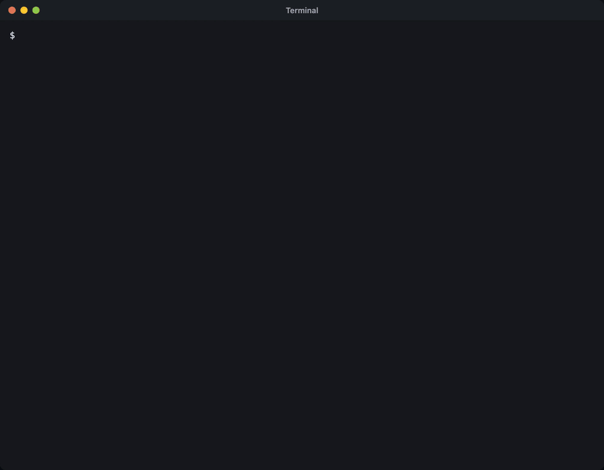

# <picture><source media="(prefers-color-scheme: dark)" srcset="docs/leverage-dark.svg"></picture> Leverage for Claude Code

<a href="LICENSE"></a>
<a href="https://github.com/leverage-computer/claude-plugin/actions/workflows/ci.yml"></a>
<a href=".claude-plugin/plugin.json"></a>
<a href="#requirements"></a>

[Install](#install) · [Usage](#usage) ·
[Features](#features) · [leverage.computer](https://leverage.computer)

[](docs/setup.mp4)


## Install


### Requirements

- Claude Code 2.1.286 or later
- A Leverage account

```sh
claude plugin marketplace add leverage-computer/claude-plugin
claude plugin install leverage@leverage
```

## Usage

- `/leverage login`: sign in, and approve in the browser.
- `/leverage`: open the pane.
- Press a session to run it here: click it, or ctrl+x tab, Tab to it, Enter.

To start a new session in a space, use the Leverage CLI:

```sh
leverage claude <space>
```

## Features

- **One session, two places.** Text and thinking stream as Leverage writes
  them.

  [](docs/first-session.mp4)

- **Teammates.** Shared visibility of our messages, status, typing indicators
  inside of Claude Code.

  [](docs/teammates.mp4)

- **Steering.** Enter over a running turn steers it. ctrl+x enter keeps the
  prompt in Claude Code's queue, where you can edit it or take it back, until
  its turn starts.
- **Approvals and questions** show in Claude Code's own dialogs.

  [](docs/approvals.mp4)

- **Subagents** run Leverage subagents as Claude Code's own agents.
- **The Leverage pane** lists your spaces, their sessions.
  `/leverage` opens the pane again.

  [](docs/sessions.mp4)

- **`/leverage help`** lists the actions you can do with Leverage mod.

## License

[MIT](LICENSE)
