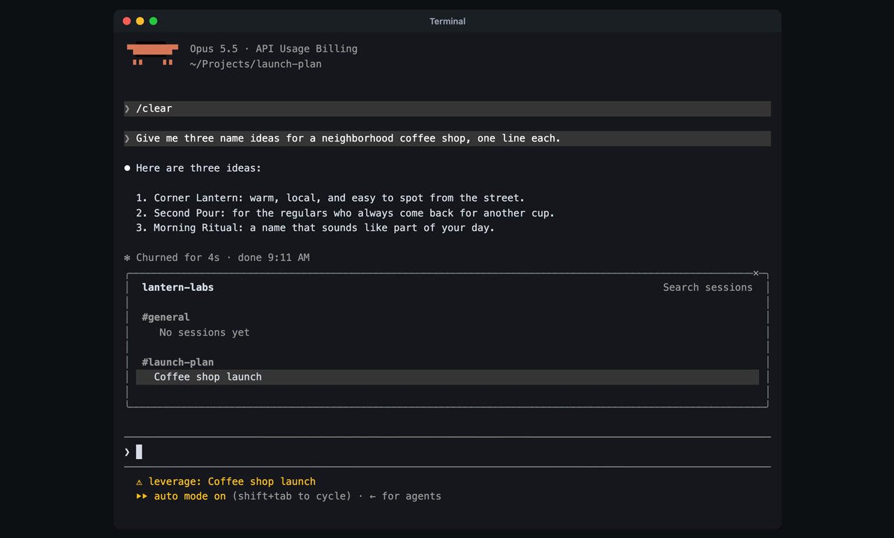

# Leverage for Claude Code

Use Claude Code as a window on a Leverage session. The turn runs in Leverage,
and Claude Code shows it as its own. Your teammates see the same session in
Leverage, and they can join it from there.

[](docs/setup.mp4)

[Watch the setup](docs/setup.mp4) (51s): install the plugin from Claude Code,
open a session from `/leverage`, and send it a prompt.

## Requirements

- Claude Code 2.1.286 or later
- The Leverage CLI, signed in (`leverage login`)

## Install

In Claude Code:

```
/plugin marketplace add leverage-computer/claude-plugin
/plugin install leverage@leverage
```

Pick "Install for you (user scope)". The plugin is active right away, with no
restart.

Or from a terminal:

```sh
claude plugin marketplace add leverage-computer/claude-plugin
claude plugin install leverage@leverage
```

## Use

In any Claude Code window, as one you start with `claude` or one in Claude
Desktop, `/leverage` opens the Leverage pane. Press a session there: click it,
or press ctrl+x tab, Tab to the session, then Enter. The window stays Claude
Code's own until you press a session; from then on it runs that session, and
your prompts go to it.

The pane needs the token the Leverage CLI keeps, so run `leverage claude` once
on this machine first. See [Your token](#your-token).

To start a new session in a space, or to open one session directly, start
Claude Code from the CLI:

```sh
leverage claude <space>
leverage claude --session <id>
```

The first prompt starts a session in the space. Like every new session in a
space, it is private until you share it.

## What you get

- **One session, two places.** Text and thinking stream as Leverage writes
  them. Tool calls show as Claude Code's own. Esc stops the turn in Leverage.
- **Teammates.** A prompt a teammate sends from Leverage opens a turn here,
  under their name. Above the prompt, you see who else has the session open,
  and who types. They see you type too.
- **Steering.** Enter over a running turn steers it. ctrl+x enter keeps the
  prompt in Claude Code's queue, where you can edit it or take it back, until
  its turn starts.
- **Approvals and questions** show in Claude Code's own dialogs.
- **Subagents** run as Claude Code's own agents: their steps show under the
  Agent call and in Claude Code's agents view.
- **The Leverage pane** lists your spaces, their sessions and connections,
  with who else has each session open and who types there. Press a session to
  open it in this window. Under the session open here, the pane shows the
  calls that wait on you, the queue, the files its last turn wrote and its
  changes, and lets you act on each.
  `/leverage` opens the pane again.
- **`/leverage help`** lists the actions: approvals, rename, archive and
  restore, model and effort, the queue, outputs, files, a shell command, changes
  and pull requests, skills, connectors and history. `/compact` and
  `/rename` act on the Leverage session.

## Your token

`leverage claude` keeps a Claude Code token for your workspace and starts
Claude Code with it. Other Claude Code windows read the same token from the
Leverage CLI's config. The plugin acts only with that token; without one,
`/leverage` says how to get it. `leverage login` and `leverage logout` drop
the kept token; run `leverage claude` again after either. To revoke the token,
open Leverage Settings → External harnesses → Claude Code.

## License

[MIT](LICENSE)
